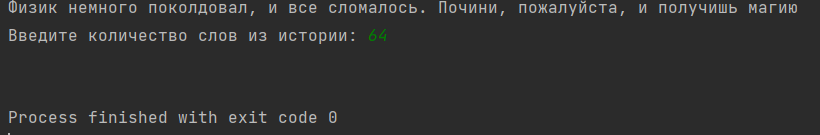
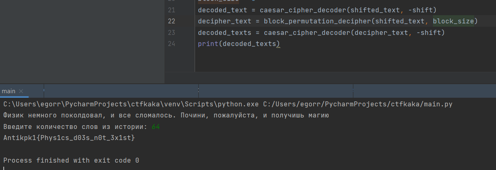

По заданию нам был предоставлен код какой-то программы. В нем можно увидеть нечто похожее на шифрование сдвигом и еще какое-то шифрование. Нас просят указать количество слов в истории, в которой 64 слова. Когда мы пытаемся написать это, мы получаем в ответ пустоту (рис. 1).

Рассмотрев код программы подробнее, можно заметить, что "-" перед block_size не нужен. Уберем его, и получим флаг (рисунок 2).

Флаг найден.