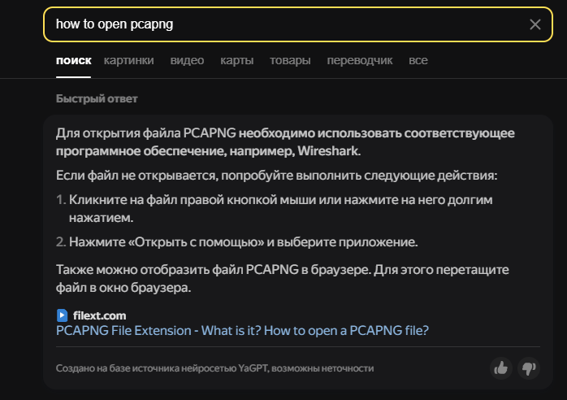
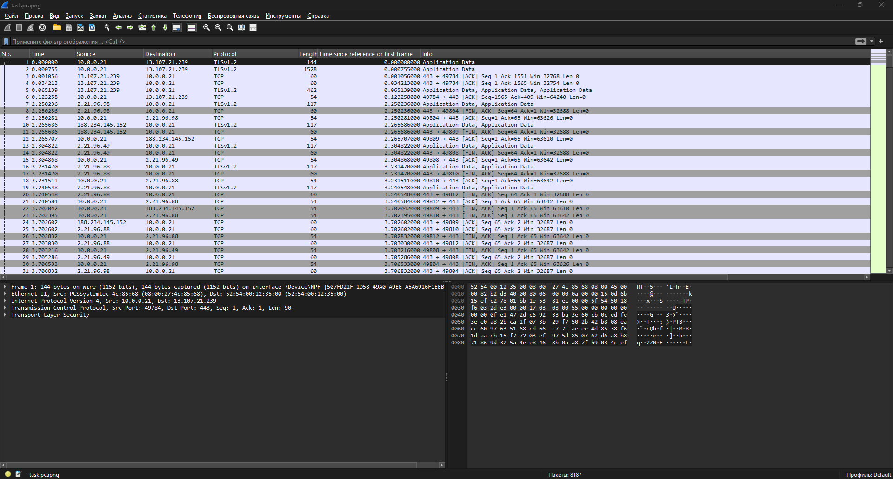
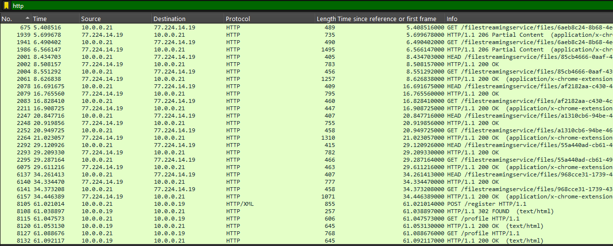
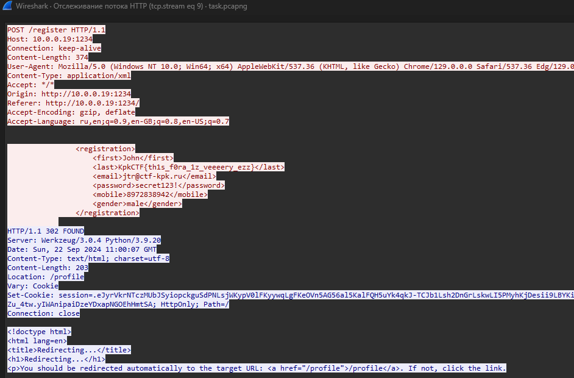

## Название таска: PCAP boy

### Этап 1: разведка

#### 1. Перед нами файл формата pcapng. Для решения необходимо отыскать способ открытия этого файла. Ищем, чем можно открыть такой формат:

---
### Этап 2: реализация

#### Скачиваем Wireshark, переходим к анализу структуры файла:

#### Файл состоит преимущественно из TCP, TLS и HTTP пакетов. Самым верным решением в данной ситуации будет отфильтровать HTTP пакеты и рассмотреть их содержимое:

#### Интересными кажутся вызовы роутов /register и /profile, так как скорее всего именно там передается информация о "человеке с самой необычной фамилией". Будем следовать за HTTP-стримом пакета 8105:

#### Тайна разгадана, фамилия найдена:

---
## Флаг: KpkCTF{th1s_f0ra_1z_veeeery_ezz}