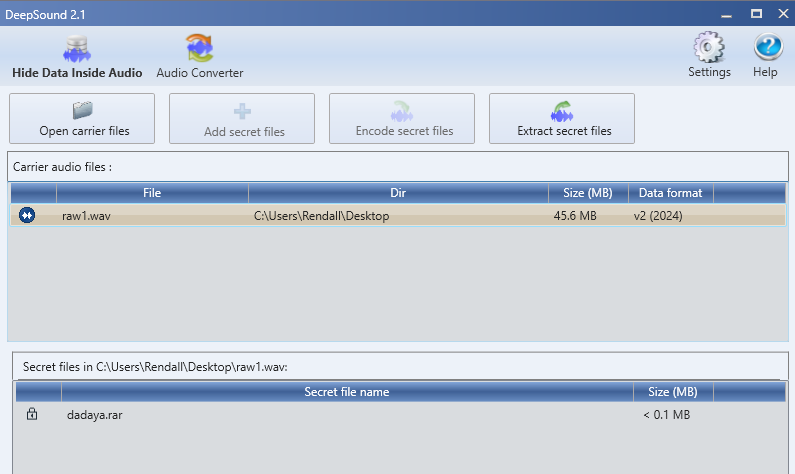
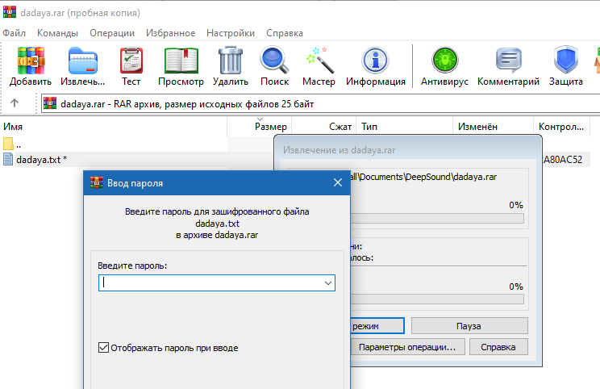

1.	Смотрим с помощью сторонних программ внутренности файла “raw1.wav”
(В моём случае DeepSound)

2.	Видим файл “dadaya.rar” и открываем его.

Файл требует пароль, а значит пробуем большой список перебора паролей (rockyou)
3.	Идём искать пароль. Переходим в линукс и используем команду “rar2john”

Используем команды: “rar2john dadaya.rar > rar.hash” Чтобы получить хэш пароля
А после идёт перебор “john –wordlist=rockyou.txt –fork=4 rar.hash”
 

warcraftdota
4.	Открываем txt файл и получаем флаг
Antikpk1{d0tk@_k@k_d0tka}
