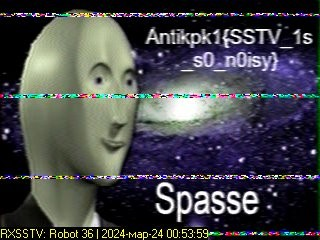

Открываем файл. Слышим непонятный шум, похожий на модем.

Гуглим: Первый спутник, сфотографировавший обратную сторону луны.
 
Видим, что Модуль Луны-3 Енисей передавал информацию через Телевидение с медленной развёрткой.

Гуглим: Как принять сигнал SSTV?

По ссылке следуем мануалу: https://r4uab.ru/priyom-izobrazhenij-sstv-s-borta-mks/

Вводим флаг с полученной картинки: Antikpk1{SSTV_1s_s0_n0isy}