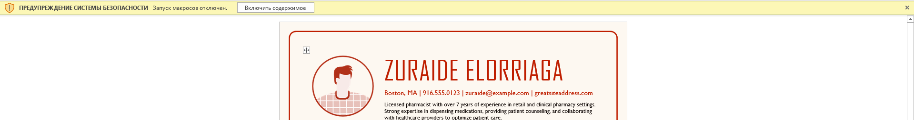
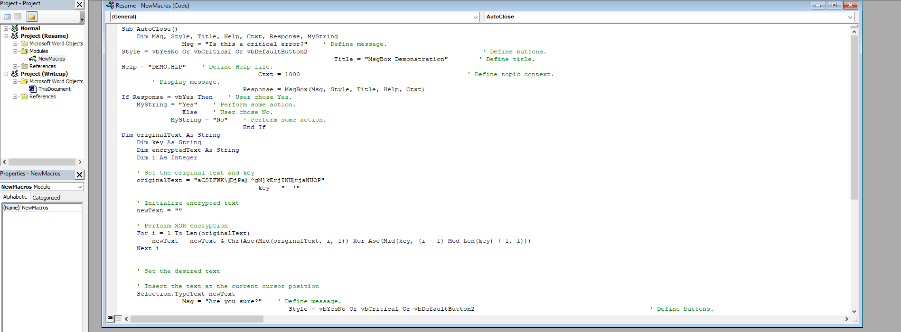
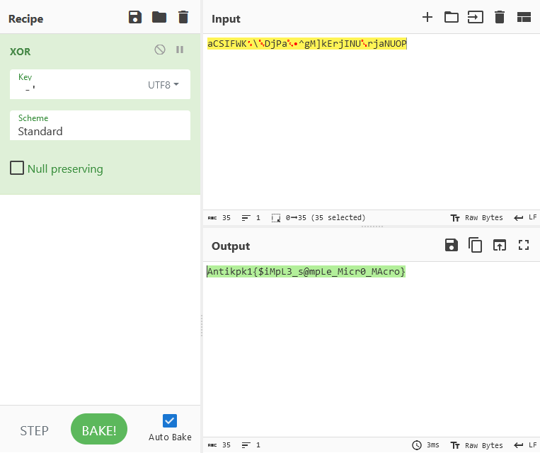

# Writeup задания “Что в моём резюме”

При открытии файла нас встречает уведомление о безопасности, которое говорит об отключении макросов

Переходим в меню макросов, находим макрос под названием “AutoClose”, изучаем его содержимое

Находим переменную “originalText”, а также “key” под ней. В самом макросе есть подсказка, которая приводит нас к XOR шифрованию. Копируем текст и ключ в дешифратор, получаем флаг.

Флаг получен: Antikpk1{$iMpL3_s@mpLe_Micr0_MAcro}