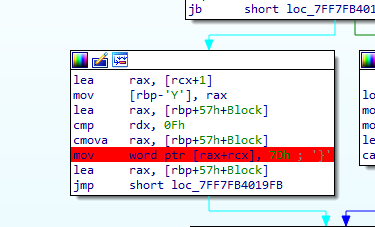

---

---
---
## Название таска: Подпись вроде норм

**Описание к таску:** я что то забыл как я проверяю подпись, наверное надо покопаться в памяти и сразу вспомню.

глянув в псевдокод и опираясь на описание можно предположить что скорее всего выполняется генерация подписи каким либо алгоритмом шифрования или же проверка этой подписи 

как можно заметить никакого взаимодействия с пользователем по типу ввода или вывода нет 

проанализировав код можно заметить что в конце какой то переменной добавляется фигурная скобка похожая на окончания флага

можно поставить брейкпоинт и посмотреть что происходит в памяти на этом участке кода
и можно заметить в одном из регистров собственно сам флаг 

**Флаг:** KpkCTF{7cfb7e521a372c20}
