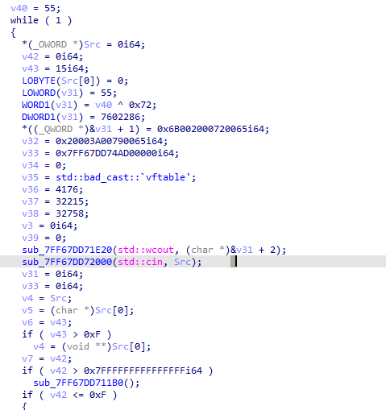
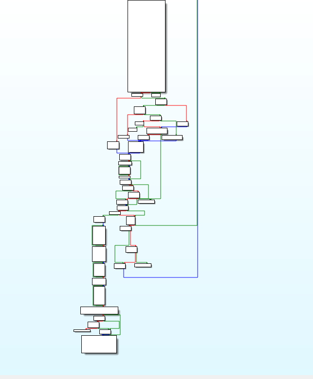
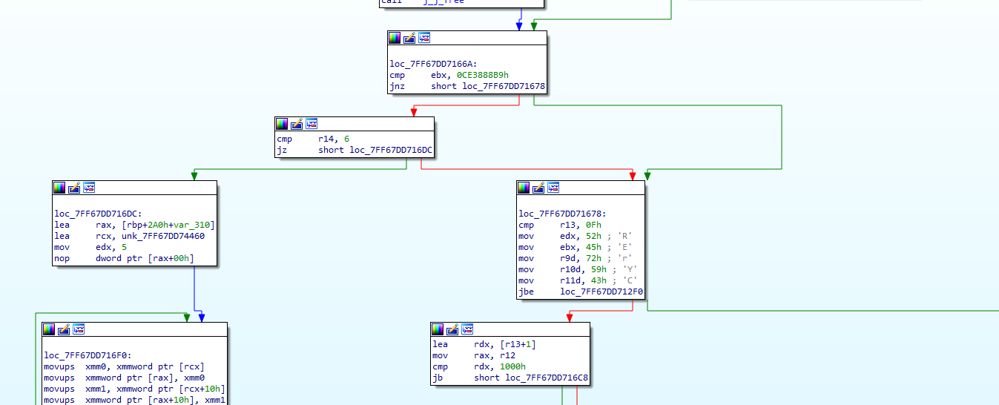
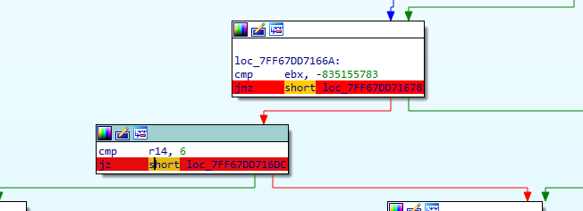
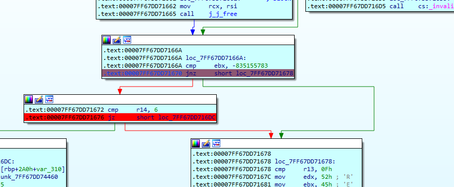
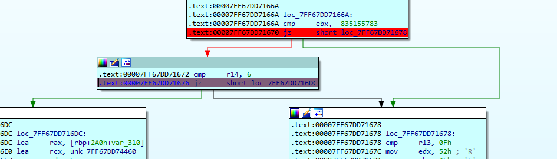
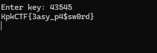

---

---
---
## Название таска: Забытый пароль

**Описание к таску:** не могу никак вспомнить пароль, ну не брутить же...

перед нами какое то топорный исполняемый файл на проверку пароля, первым делом нужно понять зависит ли как то то что мы вводим с генерацией флага или же нет

находим в псевдокоде функцию отвечающую за пользовательский ввод

проанализировав код понимаем что ввод просто проверяется на правильность разными способами но не влияет на вывод 

если обратить внимание на главную структуру кода можно заметить главный цикл 

так как мы знаем что после неудачного ввода нам предлагаю вводить пароль еще раз, следовательно предполагаем что этот большой цикл и отвечает за ввод и проверку ввода пароля

находим куски кода где происходит разветвление

видим что у нас две проверки, попробуем методом патча проскипать их
ставим брейпоинты и включаем дебаг

вводим рандомный пароль 

и так как он не правильный нас ведет по правой ветке, меняем условие перехода путем замены инструкции jnz на jz

одну проверку мы прошли , осталось пройти вторую, аналогично повторяем действия но только теперь уже меняем jz на jnz

**Флаг:** KpkCTF{3asy_p4$sw0rd}
