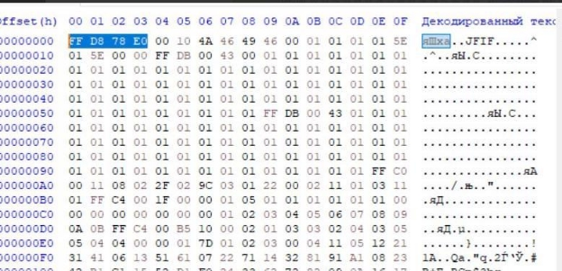
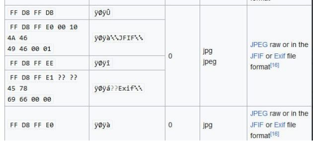
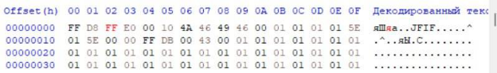
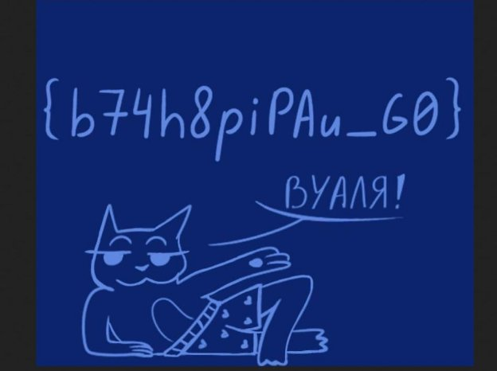

ОПЯТЬ БАЙТЯТ 

В задании нам даётся файл который не открывается простыми способами. Поэтому попробуем его открыть через шестнадцатиричный редактор. 

Обычно в первых 4 значениях зашифровывается формат документа. Посмотрим что у нас за формат: 

Получилось найти только похожие подписи, попробуем подставить чтот-то из найденных подписей, сохрняем. 

Получаем флаг: 

