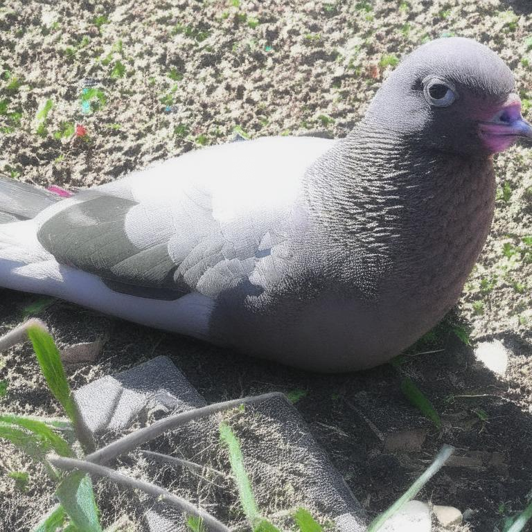
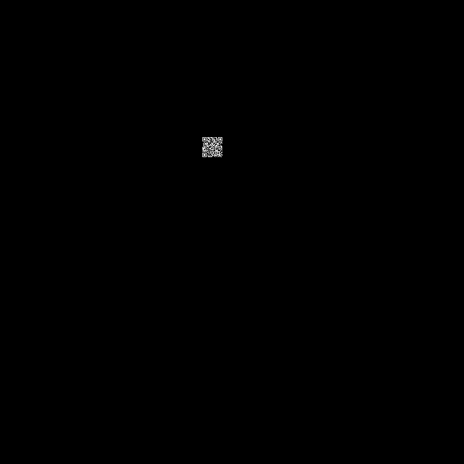
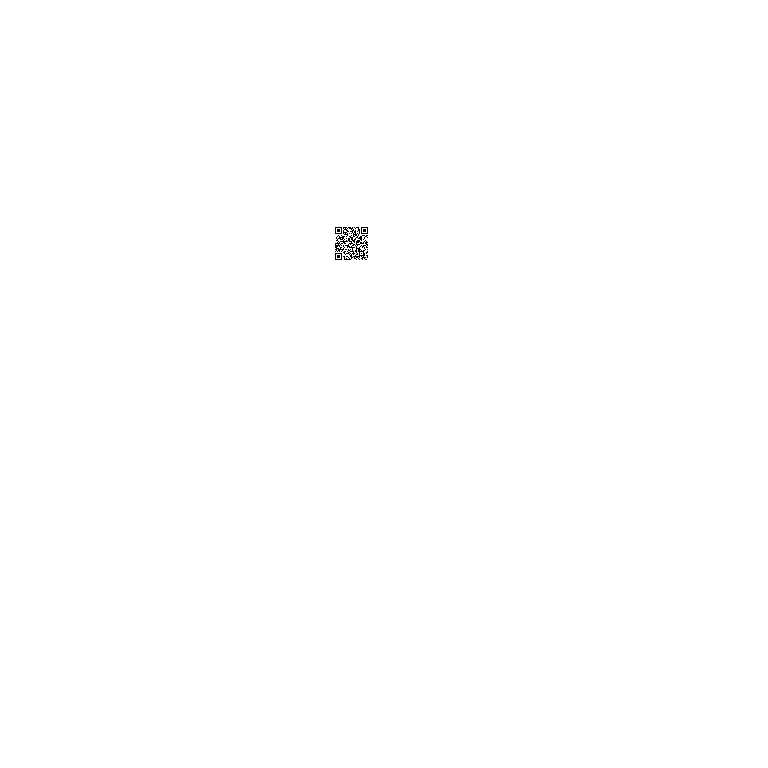

Мы имеем изображение:

С помощью stegsolve, можно извлечь alpha канал из изображения, который отличается от основного канала. Получаем инвертированный qr code в центре изображения:

Инвертируем его: 

Сканируем, получаем флаг: Antikpk1{@lph@_1s_f0r3v3r}