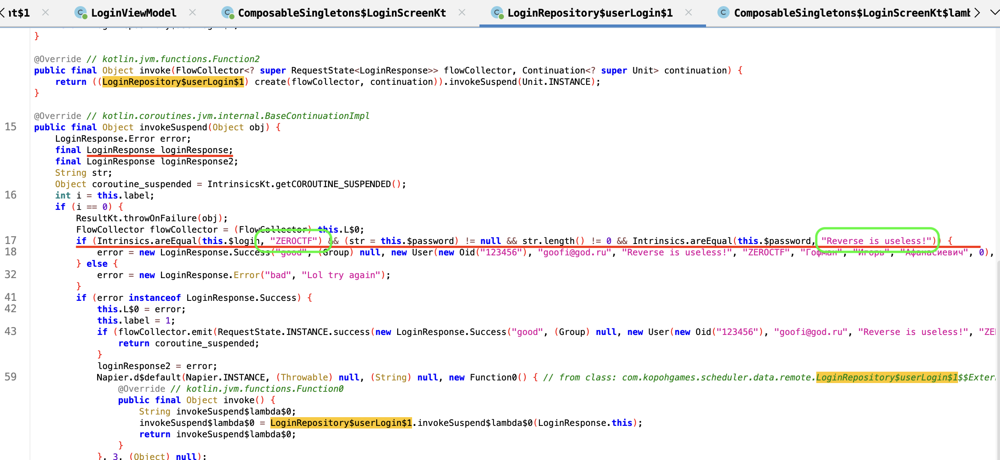

## Solution 1 (JADX)
First of all, download JADX 
After that open the APK file attached to the shuffle
And examine the structure of the project

Often everything we need is stored in package ID in our case it is com -> KopohGames.Scheduler (com.KopohGames.Scheduler).
Since our first problem is the application login screen, we need to find this screen in the code of the decompiled application.
.
By examining the ==LoginScreen== file.
Find the code fragment that is responsible for login (named ==LoginResponse==).

	The lines of code that relate to the processing of logging into the application are marked with a blue square.

Find the lines that are responsible for the state of the variable ==LoginResponse==, which are taken from such an entity as ViewModel with the name ==LoginViewModel==.

	Using ViewModel is a standard application development practice, the MVVM pattern 
	The lines of reference to the ViewModel entity are marked with green squares.

Next we find the code section responsible for successful authorisation in the application (circled in magenta) 

Go to ==LoginViewModel== to study the login mechanism, here we find the function ==loginUser()==, which accepts login and password inside itself, we are on the right track.

We see an appeal to the ==LoginRepository== file.
Further clicking on the method ==userLogin(login, password)== we get a link to this method

Going to the method already inside ==LoginRepository==, we see the familiar ==LoginResponse== going down a little further, we see a conditional expression that literally means that if(login == ‘ZEROCTF’ && password == ‘Reverse is useless!’)


The login data for login is ZEROCTF and password is Reverse is useless!

Then we log into the application, and see this.

And the flag is this 
```
KpkCTF{$ch3dule_w@s_t3ribb1e}
```

## Solution 2 (IDA)

If it can be solved via JADX/ApkTools and other tools for decompiling AKP files, then you can find the right places and code blocks in IDA too
