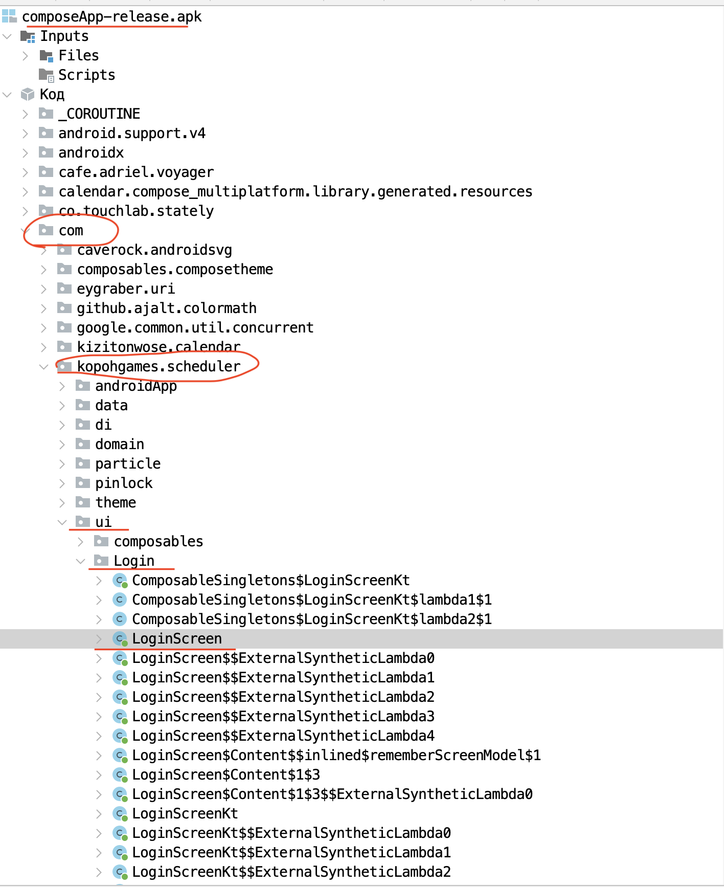
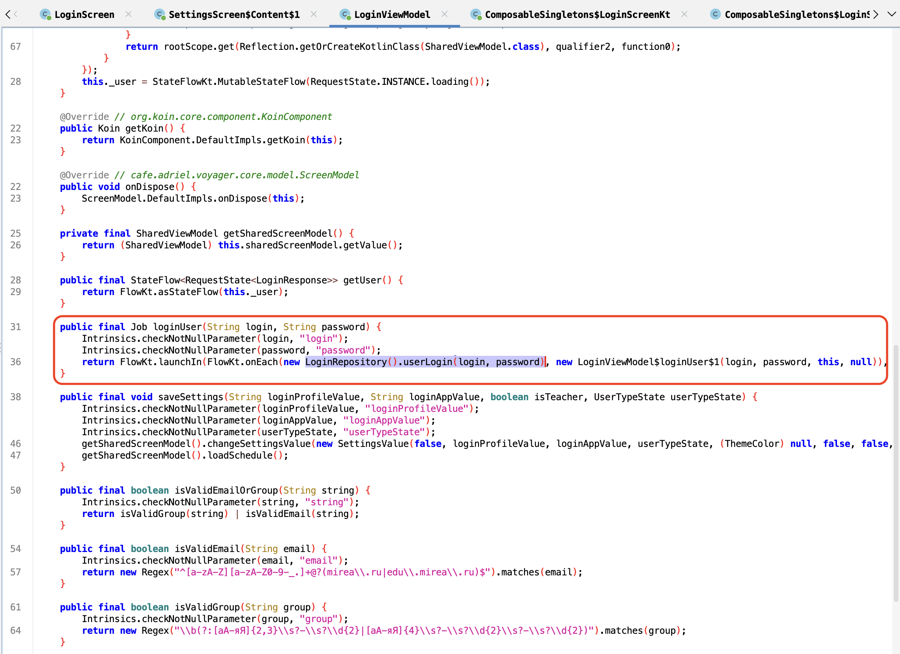
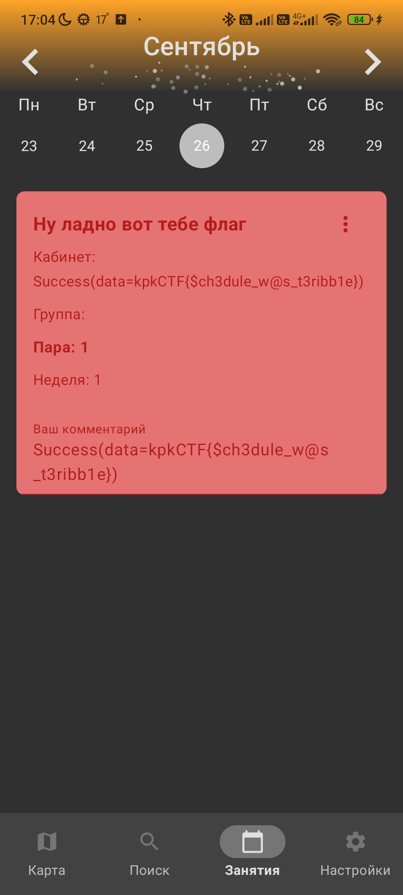

## Решение 1 (JADX)
Для начала скачиваем JADX 
После этого открываем прилагаемый к таску APK файл
И исследуем структуру проекта

Зачастую всё что нужно хранится в package ID в нашем случае это com -> KopohGames.Scheduler (com.KopohGames.Scheduler)
Т.к. наша первая проблема  это экран входа в приложение, мы должны найти этот экран в коде раздекомпилированного приложения.

Изучая файл ==LoginScreen==
Находим участок кода который отвечает за вход (по названию ==LoginResponse==)

	Строчки кода что относятся к обработке входа в приложение отмечены синим квадратиком

Находим строчки что отвечают за состояние переменной  ==LoginResponse==, которые берутся из такой сущности как ViewModel с названием ==LoginViewModel==

	Использование ViewModel это cтандартная практика разработки приложений, паттерн MVVM 
	Строчки обращения к сущности ViewModel отмечены зелеными квадратиками

Далее находим участок кода отвечающий за успешную авторизацию в приложении (обведены пурпурным цветом) 

Переходим в ==LoginViewModel== для изучения механизма входа, находим тут функцию ==loginUser()==, которая внутрь себя принимает логин и пароль, мы на правильном пути

Видим обращение к файлу ==LoginRepository==
Дальше кликая по методу ==userLogin(login, password)== получаем ссылку на этот метод

Перейдя в метод уже внутри ==LoginRepository==, мы видим уже знакомый ==LoginResponse== спустившись немного далее, мы наблюдаем условное выражение которое буквально значит что if(login == "ZEROCTF" && password == "Reverse is useless!")


Данные для входа login это ZEROCTF и password это Reverse is useless!

Далее заходим в приложение и видим это 

И флаг это 
```
KpkCTF{$ch3dule_w@s_t3ribb1e}
```

## Решение 2 (IDA)

Если это можно решить через JADX/ApkTools и остальные инструменты для декомпиляции AKP файлов, значит и в IDA можно найти нужные места и блоки кода
