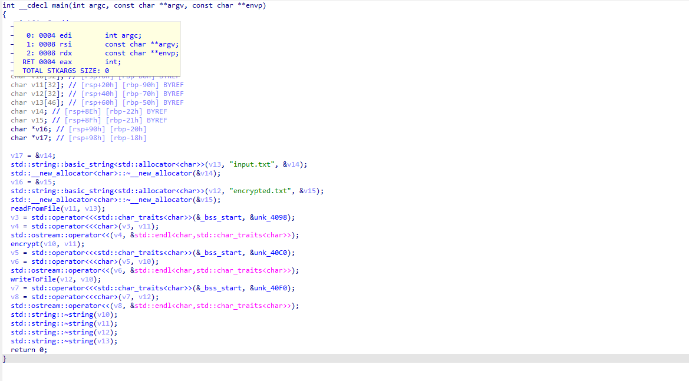
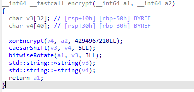
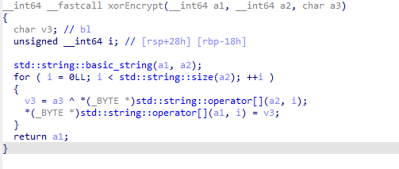
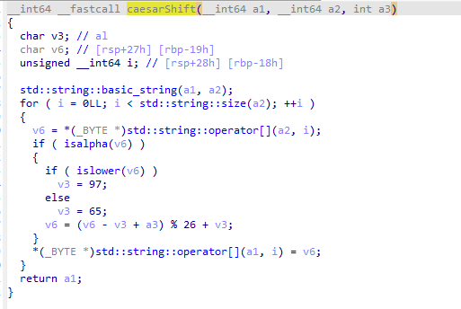
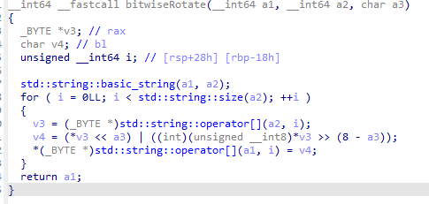
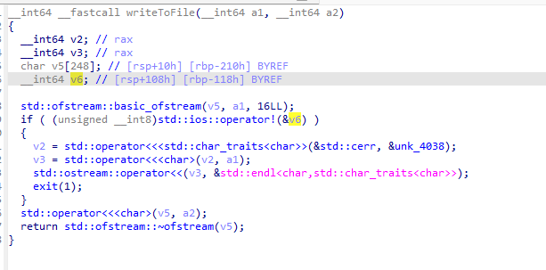

Мы получаем файл `encrypted.txt` и файл `a.out.elf` 

Внутри `encrypted.txt` лежит странная строка. Остается только изучить `elf` файл. Открываем файл в ida




Мы видим функцию `readFromFile`, а так же функцию `encrypt`




Здесь 3 функции `xorEncrypt` , `caesarShift` и `bitwiseRotate` . 

Начнем с `xorEncrypt`



После анализа функции можно воссоздать исходный алгоритм . Это простая операция xor с каждым символом в исходной строке


```C++
std::string xorEncrypt(const std::string& input, char key) {
    std::string output = input;
    for (size_t i = 0; i < input.size(); ++i) {
        output[i] = input[i] ^ key; // XOR с ключом
    }
    return output;
}
```

`key` - ключ передающийся в функцию

Далее идет функция `caesarShift` . В процессе анализа видно, что это простой шифр цезаря. 



После анализа так же можно воссоздать исходный код

```C++
std::string caesarShift(const std::string& input, int shift) {
    std::string output = input;
    for (size_t i = 0; i < input.size(); ++i) {
        char shifted = input[i];
        if (isalpha(shifted)) {
            char base = islower(shifted) ? 'a' : 'A';
            shifted = (shifted - base + shift) % 26 + base; // Шифр Цезаря
        }
        output[i] = shifted;
    }
    return output;
}
```

Далее идет функция `bitwiseRotate` .  Эта побитовый сдвиг




```C++
std::string bitwiseRotate(const std::string& input, int rotateBy) {
    std::string output = input;
    for (size_t i = 0; i < input.size(); ++i) {
        unsigned char ch = input[i];
        ch = (ch << rotateBy) | (ch >> (8 - rotateBy)); // Циклический сдвиг
        output[i] = ch;
    }
    return output;
}
```


Результат будет записан в файл, с помощью функции `writeToFile`




## Алгоритм дешифровки

Теперь, когда мы восстановили исходный алгоритм, можно попробовать написать алгоритм дешифровки. Дешифровывать нужно с конца, поэтому в начале нужно восстановить алгоритм циклического сдвига. Для этого нужно инвертировать функцию `bitwiseRotate`

```C++
std::string bitwiseRotateDecrypt(const std::string& input, int rotateBy) {
    std::string output = input;
    for (size_t i = 0; i < input.size(); ++i) {
        unsigned char ch = input[i];
        ch = (ch >> rotateBy) | (ch << (8 - rotateBy)); // Обратный циклический сдвиг
        output[i] = ch;
    }
    return output;
}
```


Далее следует шифр цезаря. Т.к у нас есть ключ, расшифроватиь его так же не сложно

```C++
std::string caesarShiftDecrypt(const std::string& input, int shift) {
    std::string output = input;
    for (size_t i = 0; i < input.size(); ++i) {
        char shifted = input[i];
        if (isalpha(shifted)) {
            char base = islower(shifted) ? 'a' : 'A';
            shifted = (shifted - base + (26 - shift)) % 26 + base; // Обратный шифр Цезаря
        }
        output[i] = shifted;
    }
    return output;
}
```

Последним этапом дешифровки должен быть xor каждого бита с ключем, который так же легко получить(он паередается в функцию `xorEncrypt`)

```C++
std::string xorEncrypt(const std::string& input, char key) {
    std::string output = input;
    for (size_t i = 0; i < input.size(); ++i) {
        output[i] = input[i] ^ key; // XOR с ключом
    }
    return output;
}
```
Далее осталось лишь собрать алгоритм воедино, и расшифровать флаг


```C++
#include <iostream>
#include <fstream>
#include <string>

// Функция для XOR-шифрования (обратима, та же используется для шифрования и дешифрования)
std::string xorEncrypt(const std::string& input, char key) {
    std::string output = input;
    for (size_t i = 0; i < input.size(); ++i) {
        output[i] = input[i] ^ key; // XOR с ключом
    }
    return output;
}

// Функция для обратного шифра Цезаря (сдвиг на отрицательное количество позиций)
std::string caesarShiftDecrypt(const std::string& input, int shift) {
    std::string output = input;
    for (size_t i = 0; i < input.size(); ++i) {
        char shifted = input[i];
        if (isalpha(shifted)) {
            char base = islower(shifted) ? 'a' : 'A';
            shifted = (shifted - base + (26 - shift)) % 26 + base; // Обратный шифр Цезаря
        }
        output[i] = shifted;
    }
    return output;
}

// Функция для обратного циклического сдвига битов
std::string bitwiseRotateDecrypt(const std::string& input, int rotateBy) {
    std::string output = input;
    for (size_t i = 0; i < input.size(); ++i) {
        unsigned char ch = input[i];
        ch = (ch >> rotateBy) | (ch << (8 - rotateBy)); // Обратный циклический сдвиг
        output[i] = ch;
    }
    return output;
}

// Основная функция дешифрования строки
std::string decrypt(const std::string& input) {
    std::string step1 = bitwiseRotateDecrypt(input, 3);  // Шаг 1: Обратный циклический сдвиг на 3 бита вправо
    std::string step2 = caesarShiftDecrypt(step1, 5);    // Шаг 2: Обратный шифр Цезаря с сдвигом на 5
    std::string step3 = xorEncrypt(step2, 0xAA);         // Шаг 3: XOR с тем же ключом 0xAA
    return step3;
}

// Функция для чтения строки из файла
std::string readFromFile(const std::string& filename) {
    std::ifstream infile(filename);
    if (!infile) {
        std::cerr << "Не удалось открыть файл: " << filename << std::endl;
        exit(1);
    }
    std::string content((std::istreambuf_iterator<char>(infile)),
                         std::istreambuf_iterator<char>());
    return content;
}

// Функция для записи строки в файл
void writeToFile(const std::string& filename, const std::string& content) {
    std::ofstream outfile(filename);
    if (!outfile) {
        std::cerr << "Не удалось открыть файл для записи: " << filename << std::endl;
        exit(1);
    }
    outfile << content;
}

int main() {
    std::string inputFilename = "encrypted.txt";  // Файл с зашифрованной строкой
    std::string outputFilename = "2_decrypted.txt"; // Файл для записи расшифрованной строки

    // Чтение зашифрованной строки из файла
    std::string encrypted = readFromFile(inputFilename);
    std::cout << "Прочитанная зашифрованная строка: " << encrypted << std::endl;

    // Дешифрование строки
    std::string decrypted = decrypt(encrypted);
    std::cout << "Расшифрованная строка: " << decrypted << std::endl;

    // Запись расшифрованной строки в файл
    writeToFile(outputFilename, decrypted);
    std::cout << "Расшифрованная строка записана в файл: " << outputFilename << std::endl;

    return 0;
}

```


Осталось скомпилировать, и получить флаг

```bash
g++ antitask.cpp -o payload
./payload
```
```
Прочитанная зашифрованная строка: �O�g��.��&�N~�������~&n�&~~ƾ
Расшифрованная строка: KpkCTF{1oy_n1ce_r3s3r4_eng3neer}
Расшифрованная строка записана в файл: 2_decrypted.txt
```

Вуаля, мы получили флаг `KpkCTF{1oy_n1ce_r3s3r4_eng3neer}`
