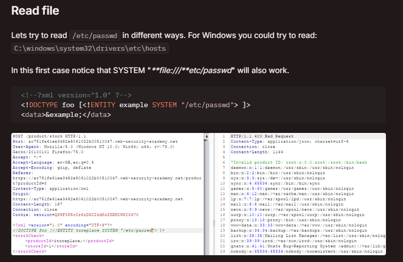

## Название таска: XeXE boy

---

### Этап 1: разведка

#### 1. Перед нами форма регистрации. Попробуем внести информацию и нажать кнопку "Submit":

#### Приложение вернуло ту же самую информацию за исключением пароля в виде профиля:

#### 2. Самое логичное решение - открыть BurpSuite и посмотреть, как информация передается на сервер:

#### Мы видим, что данные передаются в XML. Перейдем в поисковик, чтобы найти способы инъекций данного формата:

---
### Этап 2: реализация

#### 1. На hacktricks.xyz можно найти подробную информацию об осуществлении атаки внедрения внешних сущностей:

### 2. Осталось лишь перехватить трафик и переписать payload под наш формат данных, затем прочитать содержимое файла flag.txt в любое из выводимых полей

### 3. В примере выше мы вызываем сущность &xxe в узле first, значит там и будет наш флаг. Вуаля:

---
## Флаг: KpkCTF{xx3_att@ck_1s_S0_ezzzzzz}

