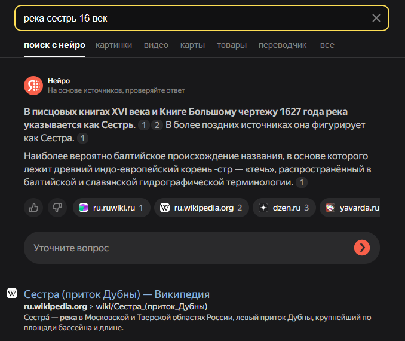
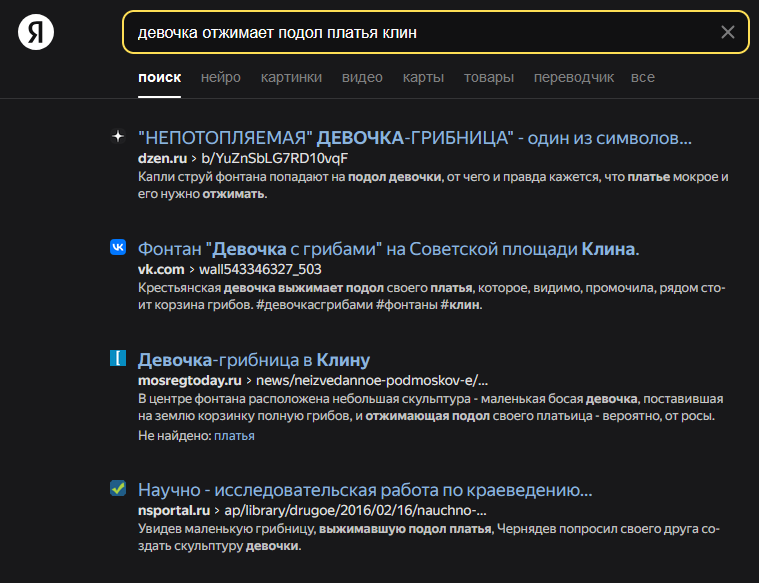
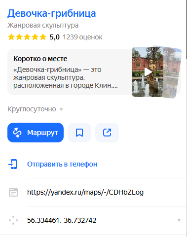

Первым делом, ищем современное название указанной в описании таска реки

На странице википедии указано, в каких городах протекает река. Путём подстановки названий города к фразе "девочка отжимает подол платья" находим, что нужный нам город - Клин. А сама девочка - скульптура

Находим скульптура на яндекс картах, вставляем координаты оттуда в обёртку флага

Флаг получен! **KpkCTF{56.334461 36.732742}**