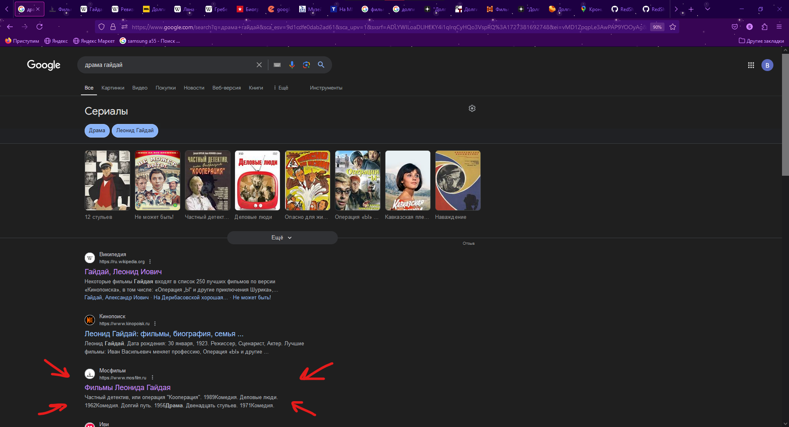
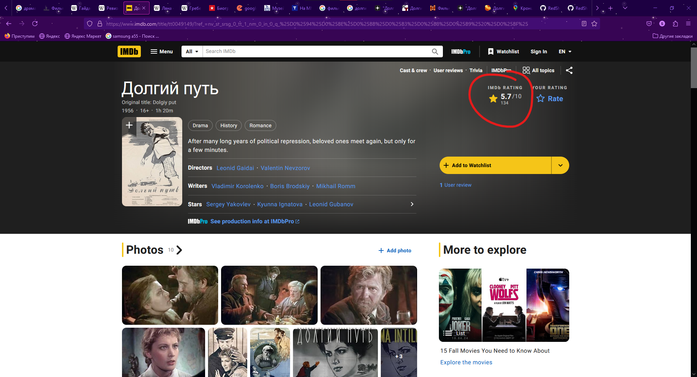
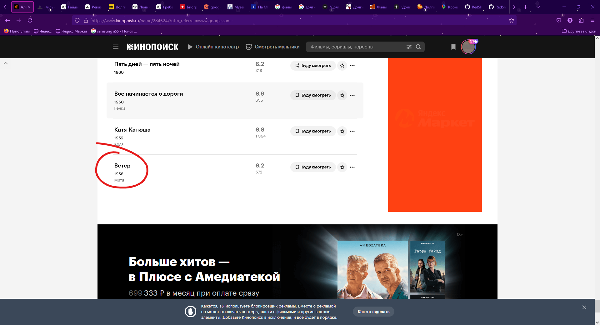
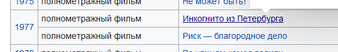
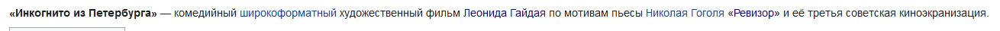

Каждый Новый год в любой российской семье не обходится без советских комедий великих режиссеров. Но мало кто знает, что у одного из них, помимо легендарных комедий, была очень драматичная картина. Найдите следующее:
1. Название и год вышеупомянутой картины в одно слово (FirstwordSecondword1234).
2. Рейтинг этой картины в известной базе фильмов (FirstNumber.SecondNumber).
3. Название картины, ставшей дебютной для артиста, сыгравшего известного героя в последующих фильмах Гайдая.
4. Название произведения, получившей третью советскую экранизацию и шестую в мире.

Ответы флага пишем в латинской литерации (Не Cool Film, а Krutoe Kino), твердые и мягкие знаки НЕ УЧИТЫВАЮТСЯ!
Вид флага: kpkCTF{FirstAnswer_SecondAnswer_ThirdAnswer_FourthAnswer}

Путь:
1. Загуглив "Драма Гайдай" мы получаем множество ссылок, однако самая информативная для первого вопроса - это ссылка на mosfilm.ru
   
   
   Пройдя по ней, мы увидели что ЕДИНСТВЕННЫЙ фильм в жанре драмы - это "Долгий путь" 1956 года.
   
   1. Известная база фильмов - это Internet Movie Database, или же IMDb.
   
   Как видим, рейтинг - 5.7 из 10
   3. Опять обратившись в интернет с вопросом "Герои фильмов Гайдая" мы получили следующий результат: 
   
   Самым известным персонажем Гайдаевских фильмов является Шурик, роль которого исполнил Александр Демьяненко. Просмотрев фильмографию Александра, мы увидим его дебютную роль в кино:
   
   4. Обратившись к знаниям литературных произведений и сверив их с фильмографией Леонида Гайдая, мы обратили внимание на следующий фильм:
   
   "Инкогнито из Петербурга" - цитата из произведения "Ревизор", написанным Н.В. Гоголем. Именно "Ревизор" получил третью советскую экранизацию под началом Гайдая
   
Суммируем ответы:
1. Долгий путь 1956 (DolgiyPut1956)
2. 5.7
3. Ветер (Veter)
4. Ревизор (Revizor)
Флаг: `kpkCTF{DolgiyPut1956_5.7_Veter_Revizor}`