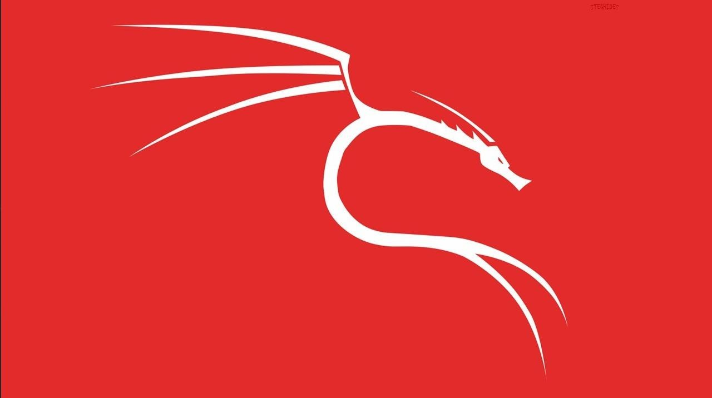
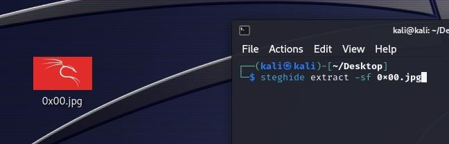
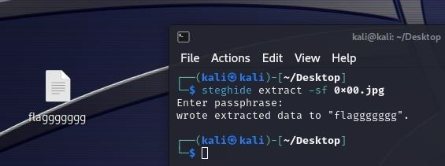

# Writeup
Загружаем полученный файл. Обращаем внимание на расширение – .jpg.
Открываем файл и анализируем его на наличие подсказок:

В	правом	верхнем	углу	можно	заметить	какой-то	текст,	гласящий
«steghide»:

Дальше все просто – если не знаем что это, проводим поиск в интернете, если знаем – закидываем фото на любимый дистрибутив, на котором есть steghide и пытаемся достать из картинки информацию.

В качестве passphrase ничего не используем – никаких других намеков на это не было, кроме текста на самой картинке (однако без него попробовать в любом случае стоит).
В результате получаем в рабочую директорию файл «flaggggggg», содержащий флаг.

